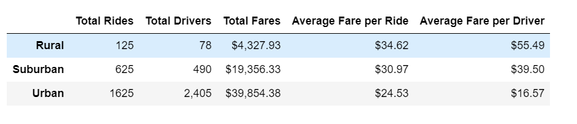

# PyBer Analysis
## Overview of the Analysis
The task is to use python's pandas, numpy, and matplotlib to analyze PyBer, a ride-sharing business. Specifically, to  provide insight on the differences between the three city types: urban, suburban, and rural. The final data is to be presented is a summary DataFrame and a multi-line graph of the total weekly fares for each city type. 

## Results

### PyBer Ride-sharing DataFrame

The summary ride-sharing DataFrame, which was compiled by merging city and ride datasets and using the groupby() function, details the differences between city types. 
The fare-per-ride and fare-per-driver averages were calculated using the Total Rides, Total Drivers and Total Fares columns.

The Urban city type had more total drivers than total rides and had the lowest average fare-per-ride. The drivers earned significantly less average fare, than their rural or suburban counterparts.

The Rural and Suburban city types both had more rides than drivers but lower total fares collected than urban drivers.  

### PyBer Ride-sharing Weekly Fare Summary Plot

As can be seen, the weekly fares collected are fairly consistent across the city types over the focused time period from Jan 1, 2019 to April 29, 2019.

## Summary

1. A contributing factor to the major differences between city types is length of trips. Rural rides would typically be the longest with suburban and then urbran following. To uncover more data, PyBer should work to include milage distance as part of their data collection. 

2. As stated, there are more total drivers than total rides in the Urban city types. Consequently, the urban areas may be overstaffed. PyBer may want to consider increase advertisements in the Urban city types to increase the total rides or consider scaling down the workforce. 

3. Advertising might be most effective in the January/February timeframe. This is the low point of urban total fare collections. This is also the low point for the suburban and rural fare collections so ads could be spread across the three different city types. 

These are three different recommendations to address the disparities among the city types.

